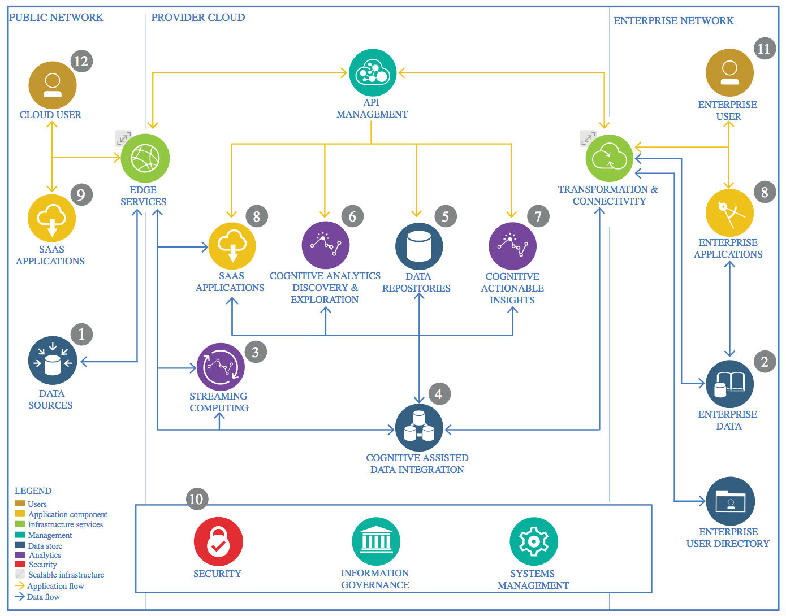

# Advanced Data Science Capstone

> "This badge earner has proven a deep understanding on massive parallel data processing, data exploration and visualization, and advanced machine learning and deep learning. The earner knows how to apply this knowledge in real-world practical use cases and can justify architectural decisions. The individual has a proven understanding of architectural methods and frameworks used in Industry Data Science projects."

__________

## Multi-Output Residual Network for Gender and Age Prediction

### Architectural Components Overview

> IBM Data and Analytics Reference Architecture. Source: IBM Corporation

#### Data Source

The Data is coming from the following dataset: https://github.com/JingchunCheng/All-Age-Faces-Dataset. It is shared by Jingchun Cheng (chengjingchun@gmail,com) and contains 13322 faces distributed across all ages ranging from 2 to 80), including 7381 females and 5941 males. For this project, only «original images» will be used, without any preprocessing already made by the original poster. 
The original naming convention for images is {ID}A{age}.png. Images in the range [0:7380] are female.

##### Technology Choice

Network's Baseline is ResNet50.

##### Justification

#### Streaming Analytics

##### Technology Choice

##### Justification

#### Data Integration

##### Technology Choice

##### Justification

#### Data Repository

##### Technology Choice

##### Justification

#### Discovery and Exploration

##### Technology Choice

##### Justification

#### Actionable Insights

##### Technology Choice

##### Justification

#### Applications / Data Products

##### Technology Choice

##### Justification

#### Security, Information Governance and Systems Management

##### Technology Choice

##### Justification